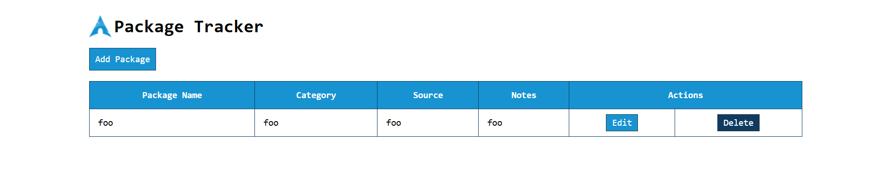
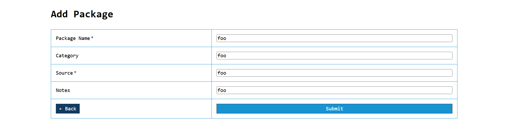
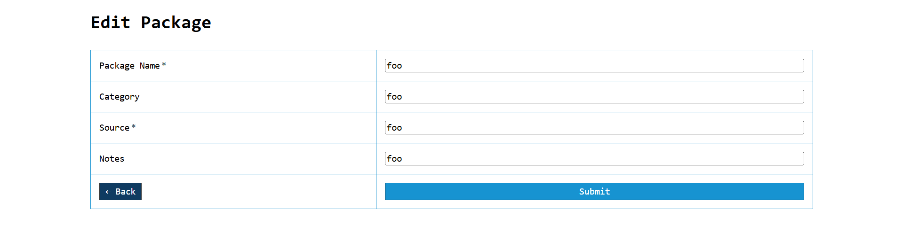

# Arch Package Tracker

A simple web-based application to help you track and manage packages for Arch Linux systems. This project was developed as a mini project for university submission.

## Features

- **Add Packages:** Submit details for new packages, including name, category, source, and notes.
- **Edit Packages:** Change details for existing packages.
- **Delete Packages:** Remove packages from your tracked list.
- **View List:** See all tracked packages.
- **Session-based Storage:** All data is stored in the current browser session (no database required).

## Screenshots

Main Dashboard

Add Package Page

Edit Package Page

## Technologies Used

- **PHP:** Backend logic and session management.
- **CSS:** Custom styling for all pages.

## Getting Started

1. Download or clone this repository.
2. Make sure you have a web server that supports PHP.
3. Place the project folder in your web server directory.
4. Open `index.php` in your web browser (e.g., `http://localhost/arch-package-tracker/index.php`).

## Usage

- Click "Add Package" to submit a new package.
- Use "Edit" or "Delete" buttons for package management.
- Data will persist as long as your browser session is active.

## Project Structure

- `index.php` - Main dashboard, displays all packages.
- `add.php` - Form for adding new packages.
- `add-process.php` - Handles form submission for adding package.
- `edit.php` - Form for editing existing package.
- `edit-process.php` - Handles form submission for editing package.
- `delete-process.php` — Handles package removal.
- `assets/css/` — Custom CSS for UI.
- `assets/img/` — Icons, logo, and screenshots.

## License

This project is licensed under the MIT License. See [LICENSE](LICENSE) for more information.
